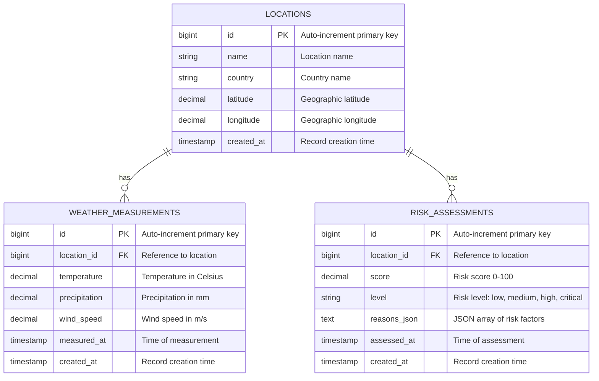
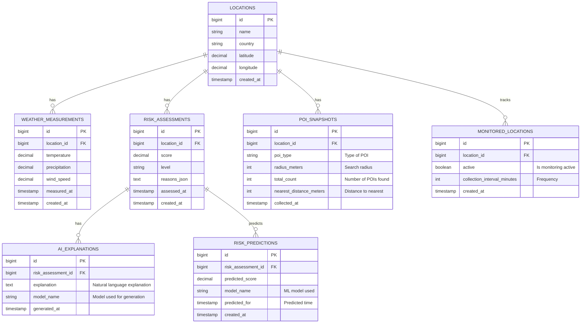

# Database Design

## Overview

GeoRisk AI uses PostgreSQL with the PostGIS extension for geospatial data storage and querying. The database is designed in two phases:

1. **MVP Phase**: Core tables for locations, weather data, and risk assessments
2. **Extended Phase**: Additional tables for AI explanations, predictions, and monitoring

---

## A. MVP Database Schema

The MVP schema includes the minimum viable set of tables to support the core functionality.

### ER Diagram (MVP)



### MVP Tables Description

#### `locations`
Stores geographic locations for risk analysis.
- `id` - Auto-increment primary key
- `name` - Human-readable location name
- `country` - Country for context
- `latitude` - Geographic latitude (decimal)
- `longitude` - Geographic longitude (decimal)
- `created_at` - Timestamp when location was added

**Indexes**: 
- Primary key on `id`
- Unique index on `(latitude, longitude)` to prevent duplicates

#### `weather_measurements`
Time-series data for weather conditions at locations.
- `id` - Auto-increment primary key
- `location_id` - Foreign key to `locations` table
- `temperature` - Temperature reading in Celsius
- `precipitation` - Precipitation amount in millimeters
- `wind_speed` - Wind speed in meters per second
- `measured_at` - Exact time of measurement
- `created_at` - Timestamp when record was stored

**Indexes**:
- Primary key on `id`
- Foreign key on `location_id`
- Index on `(location_id, measured_at)` for efficient time-range queries

#### `risk_assessments`
Risk scores and assessments for locations.
- `id` - Auto-increment primary key
- `location_id` - Foreign key to `locations` table
- `score` - Risk score as decimal 0-100
- `level` - Categorical risk level (low, medium, high, critical)
- `reasons_json` - JSON array storing risk factors and their contributions
- `assessed_at` - Time when assessment was performed
- `created_at` - Timestamp when record was stored

**Indexes**:
- Primary key on `id`
- Foreign key on `location_id`
- Index on `(location_id, assessed_at)` for historical queries

### Relationships (MVP)

- **1:N (locations → weather_measurements)**: One location has many weather measurements over time
- **1:N (locations → risk_assessments)**: One location has many risk assessments (one per assessment run)

---

## B. Extended Database Schema (Future)

The extended schema adds support for AI explanations, predictions, and continuous monitoring.

### ER Diagram (Extended)



### Extended Tables Description

#### `poi_snapshots` (NEW)
Snapshots of Points of Interest around locations.
- `id` - Auto-increment primary key
- `location_id` - Foreign key to `locations`
- `poi_type` - Type of POI (restaurant, hospital, school, etc.)
- `radius_meters` - Search radius used (e.g., 1000m)
- `total_count` - Count of POIs found in radius
- `nearest_distance_meters` - Distance to nearest POI
- `collected_at` - Time when snapshot was collected

**Purpose**: Analyzes urban density and infrastructure proximity as risk factors.

#### `ai_explanations` (NEW)
AI-generated explanations for risk assessments.
- `id` - Auto-increment primary key
- `risk_assessment_id` - Foreign key to `risk_assessments`
- `explanation` - Natural language explanation text
- `model_name` - Name/version of ML model used
- `generated_at` - Timestamp when explanation was generated

**Purpose**: Stores human-readable interpretations of risk scores without affecting score calculation.

#### `monitored_locations` (NEW)
Configuration for continuous location monitoring.
- `id` - Auto-increment primary key
- `location_id` - Foreign key to `locations`
- `active` - Boolean flag for monitoring status
- `collection_interval_minutes` - Frequency of data collection (e.g., 60 minutes)
- `created_at` - Timestamp when monitoring was configured

**Purpose**: Enables scheduled, periodic data collection for important locations.

#### `risk_predictions` (NEW)
ML-based risk predictions for future time periods.
- `id` - Auto-increment primary key
- `risk_assessment_id` - Foreign key to `risk_assessments`
- `predicted_score` - Predicted risk score (0-100)
- `model_name` - Name/version of prediction model
- `predicted_for` - Timestamp of predicted time (e.g., 24 hours from now)
- `created_at` - Timestamp when prediction was made

**Purpose**: Stores predictive insights to anticipate future risk changes.

---

## Implementation Order

The database implementation should follow this priority:

### Phase 1 (MVP - Required First)
These tables are **essential** for MVP functionality and must be implemented first:
1. `locations` - Foundation for all other features
2. `weather_measurements` - Core risk assessment input
3. `risk_assessments` - Primary output of the system

**Timeline**: Start of development (Sprint 1-2)

### Phase 2 (Extended - Future)
These tables support future features and should be added only after MVP is stable:
1. `poi_snapshots` - Adds POI analysis to risk scoring
2. `monitored_locations` - Enables scheduled collection
3. `ai_explanations` - Adds explainability
4. `risk_predictions` - Adds ML predictions

**Timeline**: After MVP validation (Sprint 4+)

---

## SQL Schema Initialization

### MVP Initialization Script

```sql
-- Enable PostGIS extension
CREATE EXTENSION IF NOT EXISTS postgis;

-- Create locations table
CREATE TABLE locations (
    id BIGSERIAL PRIMARY KEY,
    name VARCHAR(255) NOT NULL,
    country VARCHAR(100),
    latitude DECIMAL(10, 8) NOT NULL,
    longitude DECIMAL(11, 8) NOT NULL,
    created_at TIMESTAMP NOT NULL DEFAULT CURRENT_TIMESTAMP,
    UNIQUE(latitude, longitude),
    SPATIAL INDEX ON (geometry)
);

-- Create weather_measurements table
CREATE TABLE weather_measurements (
    id BIGSERIAL PRIMARY KEY,
    location_id BIGINT NOT NULL REFERENCES locations(id) ON DELETE CASCADE,
    temperature DECIMAL(5, 2),
    precipitation DECIMAL(8, 3),
    wind_speed DECIMAL(6, 2),
    measured_at TIMESTAMP NOT NULL,
    created_at TIMESTAMP NOT NULL DEFAULT CURRENT_TIMESTAMP,
    INDEX idx_location_measured (location_id, measured_at)
);

-- Create risk_assessments table
CREATE TABLE risk_assessments (
    id BIGSERIAL PRIMARY KEY,
    location_id BIGINT NOT NULL REFERENCES locations(id) ON DELETE CASCADE,
    score DECIMAL(5, 2) NOT NULL,
    level VARCHAR(20) NOT NULL CHECK (level IN ('low', 'medium', 'high', 'critical')),
    reasons_json JSONB,
    assessed_at TIMESTAMP NOT NULL,
    created_at TIMESTAMP NOT NULL DEFAULT CURRENT_TIMESTAMP,
    INDEX idx_location_assessed (location_id, assessed_at)
);
```

---

## Design Principles

1. **Immutability**: Historical data is not updated; new records are inserted
2. **Timestamps**: All tables include `created_at` for audit trails
3. **Foreign Keys**: Enforce referential integrity with CASCADE deletes
4. **Indexes**: Strategic indexes on frequently queried columns
5. **PostGIS**: Latitude/longitude can be enhanced with geometry types later
6. **JSON Storage**: `reasons_json` stores flexible risk factor data
7. **Normalization**: Normal form up to 3NF; JSON for semi-structured data

---

## Performance Considerations

- Time-series queries benefit from indexes on `(location_id, timestamp)`
- Archive old weather measurements to separate tables after retention period
- Consider partitioning by date for large `weather_measurements` table
- Use database views for common aggregations
- Monitor slow queries with PostgreSQL EXPLAIN ANALYZE

---

## Security

- Enforce row-level security if multi-tenant support is needed
- Encrypt sensitive location data at rest
- Audit all data modifications
- Use parameterized queries in application code
- Mask coordinates in logs/error messages
